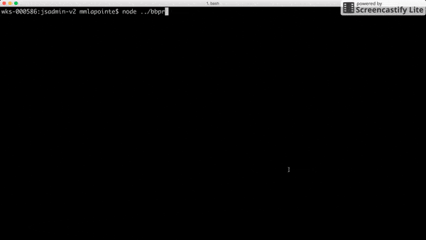

<div align="center">

<h3 style="text-decordation:none;">Light Speed Pull Requests from Your Terminal</h3>
</div>
<br>
<div align="center">

</div>

<h1 id="synopsis">Synopsis</h1>
BBPR (BitBucket Pull Requests) is an interactive, configurable, and fast command line program helping you standardize the pull request process between teammates. It is very easy to forget little details when doing a pull request, like a reviewer you had to add, or a description along your demo helping your teammates understand what they should review and where they should look for it. BBPR partners up with you on that journey, so that your future pull requests will always be picture perfect.   

<h1 id="synopsis">How it works</h1>
When you start a BBPR session, you simply answer questions about your upcoming PR so that BBPR can build it for you. Once you are done answering the questions, you can review all the information before sending your PR. Once you confirm each piece of information is accurate, BBPR sends the pull request and redirects you to BitBucket if it is successful. If not, you will receive information about why it failed, and you'll be able to adjust. It's that simple.  
 
<h1 id="installation">Installation</h1>
<h3>Step 1: Prerequisites</h3> 

First, make sure you have the following installed on your computer: <a href="https://nodejs.org/en/">node.js</a>, <a href="https://www.npmjs.com/">npm</a>, <a href="https://git-scm.com/">git</a>, and <a href="https://www.mercurial-scm.org/">mercurial</a>.   


<h3>Step 2: Clone and Install</h3>

Move to the directory level where the repositories you are working on are located, and clone this github repository with the following command:  
  
```  
git clone https://github.com/MichelML/bbpr.git  
```

After this command is executed,  move to the local directory and install all dependencies:  

```  
cd bbpr && npm install 
```     

Congratulations, BBPR is now installed properly.

<h1 id="Configuration">Use and Configuration</h1>  

BBPR comes bundled with a configuration file (`bbpr.config.js`) by default. That being said, you must absolutely provide a BitBucket organization name (ex: mycompanyid) before using BBPR. **Your BitBucket organization name is the only required entry you must provide by hand, otherwise the program will throw**.   
  
Default configuration file overview:  

```javascript 
{
    "organization": {
        "name": "" // String. Add the name of your BitBucket organization (ex: mycompanyid )
        // This will be used to access the proper BitBucket API path => /2.0/repositories/{will_be_utilized_here}/{repo_slug}/pullrequests
        // See https://developer.atlassian.com/bitbucket/api/2/reference/resource/repositories/%7Busername%7D/%7Brepo_slug%7D/pullrequests#post
    },
    "user": {
        "name": "", // String. Provide your BitBucket username (ex: michelmoreaul) so you don't have to type it at each session.
        "password": null, // null or String.
        // If null and cachePwd is set to true, this property will be set to the (encrypted) password you entered via the prompt for your next BBPR sessions.
        // If not null and cachePwd is set to true, it will use the encrypted password stored in this property. 
        // In any other case, you will be prompted at each BBPR session to provide your BitBucket password.
        "cachePwd": false // Boolean. See the password property for detailed explanation.
    },
    "demo": {
        "shouldPrompt": false, // Boolean. Set to true if you'll need a demo link with your PR.
        "shouldPromptDescription": false, // Boolean. Set to true if you'll need a description with your demo.
        "basePath": "" // String. Base path to your demo (ex. hhtps://mydemo.com/). Provide only if needing a demo. It will be ignored otherwise.
    },
    "reviewers": {
        "default": [], // Array of String. Each entry must be a valid BitBucket username. These are the reviewers who are assign to reviewing your work. An empty Array is also valid. 
        "potential": [] // Array of String. Each entry must be a valid BitBucket username. These are the reviewers who may be assigned to reviewing your work. An empty Array is also valid.
    },
    "branches": {
        "source": {
            "close": true // Array of String. Each entry must be a valid BitBucket username. These are the reviewers who may be assigned to reviewing your work. An empty Array is also valid.
        },
        "dest": {
            "default": "default" // String. Set to your main branch (ex: master or default), or the branch to which you are making PRs most often.
        }
    }
}
```  
Once this step is done, you are ready to go. You can run `node <path to your local bbpr>/bbpr` from within your local repository for which you want to make a pull request, and a session will start. If you cloned BBPR at the location suggested in the <a href="#installation">install section</a>, simply running `node ../bbpr` should work flawlessly.

That's it, may you and your teammates enjoy the BBPR way of doing BitBucket pull requests!
  
<h1 id="contribute">Contribute</h1>

Please do not hesitate to make any change at any time to BBPR by submitting a pull request.
  
<h1 id="maintainer">Maintainer</h1>
 
Michel Moreau - [michmoreau.l@gmail.com](mailto:michmoreau.l@gmail.com?Subject=BBPR%20Project) 
